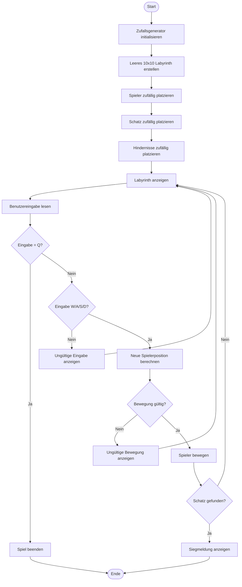

# UML-Aktivitätsdiagramm

Erklärung

Das Aktivitätsdiagramm zeigt den Ablauf des Labyrinth-Spiels. Zuerst wird das Spielfeld vorbereitet, danach werden Spieler, Schatz und Hindernisse zufällig platziert.

Anschliessend beginnt die Spielschleife. In dieser Schleife wird das Labyrinth angezeigt und eine Eingabe des Spielers gelesen. Gibt der Spieler Q ein, wird das Spiel beendet. Bei W, A, S oder D wird eine neue Position berechnet.

Vor der Bewegung wird geprüft, ob die neue Position gültig ist. Bewegungen ausserhalb des Spielfelds oder auf Hindernisse werden abgelehnt. Nach einer gültigen Bewegung wird geprüft, ob der Spieler den Schatz erreicht hat. Falls ja, endet das Spiel mit einer Siegmeldung.